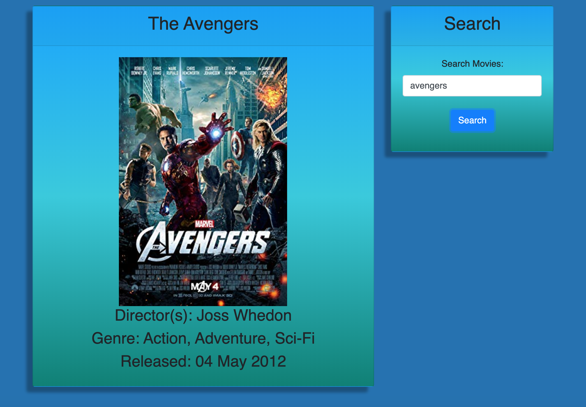

# Movie Search App
A simple movie search app that will search and return similar movies based on the movie title a user inputs in the search bar. This project was created using MERN Stack (Mong DB, Express, React, NodeJS) and search for movies using Open Movie Database(OMDb API).

# Demo
The demo of the Movie search application can be found **[Here](http://mymovieinfo.herokuapp.com/)**

## Packages Setup
1. npm init => initialize package.json
2. npm install => create package-lock.json
3. npm i mongoose => install **[mongoose package](https://www.npmjs.com/package/mongoose)**

## Technologies Implemented
>- MERN Stack(MongoDB, Express, React and NodeJS)
>- MVC design pattern: Model, View, Controller.


## Database
1. Connect to a MongoDB database named movie search using the mongoose npm package.
2. Using mongoose, create a MovieDB .
3. Movie search should render each of the following fields:
>- Title - Title of the Movie from the OMDb API
>- Director(s) - The Movie's director(s) as returned from the OMDb API
>- Genre - The Movie's genre as returned from the OMDb API
>- Released - The Movie's released date.
>- thumbnail image as returned from the OMDb API on top.

## Screenshot




- Search for Movies using OMDb API and Movie Detail as well.
``` MERN
  <Card heading="Search">
              <SearchForm
                value={this.state.search}
                handleInputChange={this.handleInputChange}
                handleFormSubmit={this.handleFormSubmit}
              />
            </Card>
            
            ------- .... -------
   <div className='text-center'>
      
      <h3>Director(s): {props.director}</h3>
      <h3>Genre: {props.genre}</h3>
      <h3>Released: {props.released}</h3>
      {/* <h3>Description:{props.description}</h3> */}
    </div>
```

## Built With

- Visual Studio Code - Text Editor
- MongoDB
- Terminal/Gitbash

# Author

>-  **[Angel-Cochachez](https://github.com/codifyme/movieinfo)**. MERN STACK DEVELOPER
@codifyme:+1 :shipit:
>- Happy Searching!!
